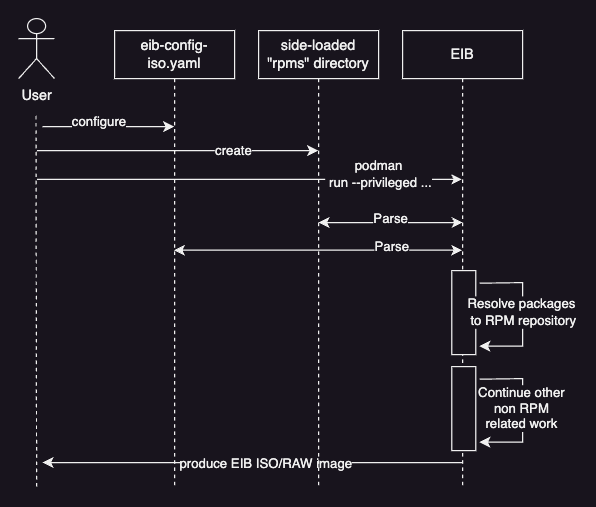
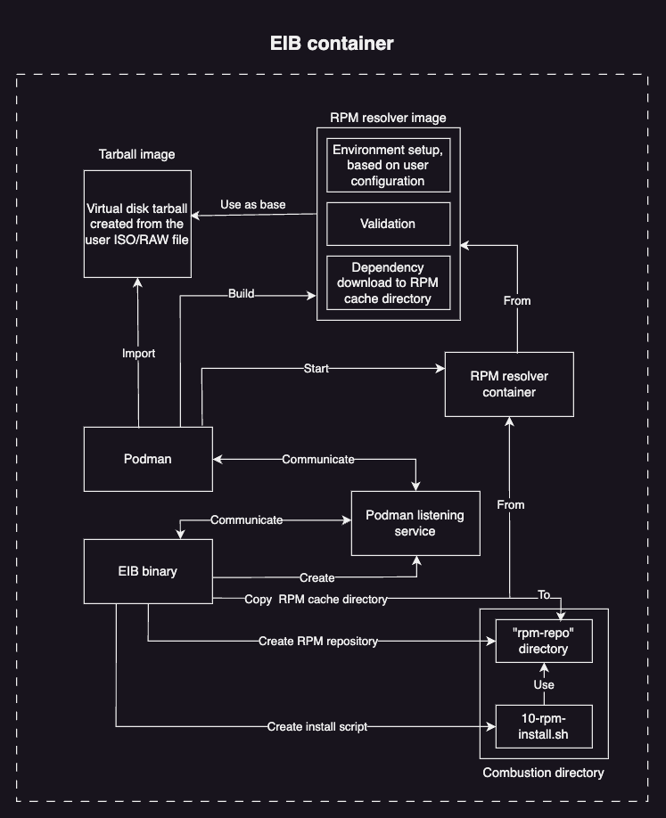

# Package resolution design
The package resolution design can be separated in three logical parts:
1. *Running the EIB container* - how to run the EIB container so that the **RPM resolution** has the needed permissions
1. *Building the EIB image* - what happens during the **RPM resolution** logic of EIB's image build
1. *Booting the EIB image* - how are the packages actually installed once the EIB image is booted for the first time

## Running the EIB container


The package resolution workflow begins with the user specifying packages and/or stand-alone RPMs that will be installed when the EIB image is booted. On how to to do a correct specification, see [Specify packages for installation](../installing-packages.md#specify-packages-for-installation).

After the desired specification has been made, the user runs the EIB container with the [`--privileged`](https://docs.podman.io/en/latest/markdown/podman-run.1.html#privileged) option, ensuring that EIB has the needed permissions to successfully run a Podman instance within its container. This is a crucial prerequisite for building a working EIB image with package installation specified (more on this in the next section). 

An example of the command can be seen below:
```shell
podman run --rm --privileged -it \
-v $IMAGE_DIR:/eib eib:dev build \
--definition-file $DEFINITION_FILE.yaml
```

> **_NOTE:_** Depending on the `cgroupVersion` that Podman operates with, you might also need to run the command with `root` permissions. This is the case for `cgroupVersion: v1`. In this version, non-root usage of the `--privileged` option is not supported. For `cgroupVersion: v2`, non-root usage is supported. 
>
>In order to check the `cgroupVersion` that Podman operates with, run the following command:
>```shell
>podman info | grep cgroupVersion
>```

Once the EIB container has been successfully executed, it parses all the user provided specification and begins the **RPM resolution** process. 

## Building the EIB image
During this phase, EIB prepares the user specified packages for installation. This process is called **RPM resolution** and it includes:
1. Validating that each provided package has a GPG signature or comes from a GPG signed RPM repository
1. Resolving and downloading the dependencies for each specified package
1. Creating a RPM repository that consists of the specified packages and their dependencies
1. Configuring the usage of this repositry for package installation during the **combustion** phase of the EIB image boot

### RPM resolution process


EIB mainly utilizes Podman's functionality to setup the environment needed for the **RPM resolution** process. In order to communicate with Podman, EIB first creates a [listening service](https://docs.podman.io/en/latest/markdown/podman-system-service.1.html) that will facilitate the communication between its own container and Podman. From here onwards, assume that any Podman related operation that EIB does goes through the **listening service** first.

Once EIB establishes communication with Podman, it parses the user configured ISO/RAW file and converts it to a Podman importable **virtual disk tarball**. This tarball is [imported](https://docs.podman.io/en/stable/markdown/podman-import.1.html) as an image in Podman. 

EIB then proceeds to build the **RPM resolver** image using the **tarball image** as a base. This procedure ensures that the validation/resolution of any packages that are specified for installation will be as close to the desired user environment as possible.

All the RPM resolution logic is done during the build of the **RPM resolver** image. This includes, but is not limited to:
1. Environment setup:
    * Connecting to SUSE's internal RPM repositories, if specified by the user through `operatingSystem.packages.sccRegistrationCode`
    * Importing any GPG keys provided by the user under `<eib-config-dir>/rpms/gpg-keys`
    * Adding any third-party RPM repositories, if specified by the user through `operatingSystem.packages.additionalRepos`
1. Validation of:
    * RPM files provided by the user under `<eib-config-dir>/rpms`
    * Third-party RPM repositories, if specified by the user through `operatingSystem.packages.additionalRepos`
1. Downloading the dependencies for all specified packages and side-loaded RPMs to a **RPM cache directory**

After a successful RPM resolver image build, EIB starts a container from the newly built image and copies the aforementioned **RPM cache directory** to the **combustion** directory located in the EIB container. This cache directory is then converted to a ready to use RPM repository by EIB.

The final step in the EIB **RPM resolution** process is to create an **install script** which uses the aforementioned RPM repository to install the user specified packages during the EIB image combustion phase.

### Troubleshooting
When troubleshooting the **RPM resolution** process, it is beneficial to look at the following files/directories inside of the EIB build directory:
1. `eib-build.log` - general logs for the whole EIB image build process
1. `podman-image-build.log` - logs for the build of the EIB resolver image. If missing, but the `resolver-image-build` directory is present, this means that there is a problem in the configuration of the `resolver-image-build` directory
1. `podman-system-service.log` - logs for the Podman listening service
1. `resolver-image-build` directory - build context for the resolver image. Make sure that the `Dockerfile` holds correct data. When installing side-loaded RPMs, make sure that the `rpms` and `gpg-keys` directories are present in the `resolver-image-build` directory
1. `resolver-tarball-image` directory - contains resources related to the creation of the **virtual disk tarball** archive. If this directory exists, this means that a problem has been encountered while EIB was trying to import the **tarball image**
1. `prepare-resolver-base-tarball-image.log` - logs related to the creation of the **virtual disk tarball**
1. `createrepo.log` - logs related to the conversion of the **RPM cache directory** to a **RPM repository**
1. `combustion/rpm-repo` directory - the **RPM repository**; should hold the desired RPMs for installation and their dependencies
1. `combustion/10-rpm-install.sh` - script that will be executed during the **combustion** phase; should use the `rpm-repo` repository and have all the expected packages specified for installation

## Booting the EIB image
During the combustion phase of the EIB image boot, as mentioned above, both the **RPM repository** and **RPM combustion script** will be present in the combustion [configuration directory](https://github.com/openSUSE/combustion?tab=readme-ov-file#combustion) respectively under `/dev/shm/combustion/config/10-rpm-install.sh` and `/dev/shm/combustion/config/rpm-repo`.

The root combustion script then calls the `10-rpm-install.sh` script, which does the following:
1. Adds the `rpm-repo` directory as a local RPM repository for its package manager
1. Installs the desired packages from the newly added `rpm-repo` repository 
1. Once all packages have been installed it removes the `rpm-repo` from the package manager

The successful execution of the `10-rpm-install.sh` script indicates that all packages have been installed on the operating system. Upon the completion of the image boot, the user should have access to every package that he specified when building the EIB image.