# Testing Built Images

Images may be run on either bare metal or virtualization. The following sections provide examples to speed
development and testing.

## libvirt

[libvirt](https://libvirt.org/) is a commonly available virtualization toolkit. Much of the development of EIB
has been tested against libvirt running on an [openSUSE Tumbleweed](https://get.opensuse.org/tumbleweed/)
installation.

### Testing Self-installing ISOs

If you're already familiar with using libvirt to create images installed from ISOs, you can skip to the section
about [resetting the VM between tests](#resetting-the-vm).

> :warning: libvirt may automatically remove the installation media after the first boot. Upon reboot, the installation
> ISO, and more importantly it's embedded combustion configuration, will not be present and combustion won't run. If
> the JeOS setup begins, the first step in debugging should be to ensure the installation media is still present
> after the initall installation writes the SLE Micro raw image to disk.


Using Virtual Machine Manager, select the option to create a new VM. 

Select the "Local install media (ISO image or CDROM)" option:

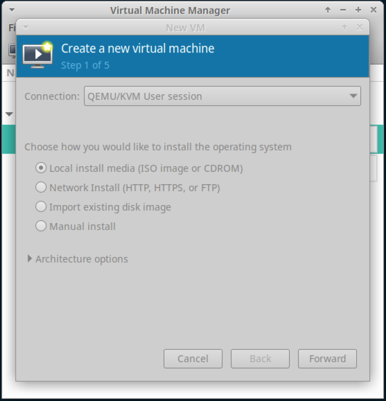

Browse to the ISO built from EIB. If Virtual Machine Manager is unable to detect the operating system, type `slem5.5`
to search for the "SUSE Linux Enterprise Micro 5.5" version:

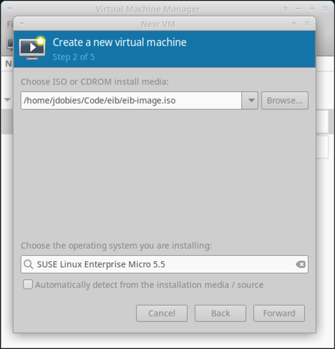

Enter the memory and CPU settings as appropriate for your host:

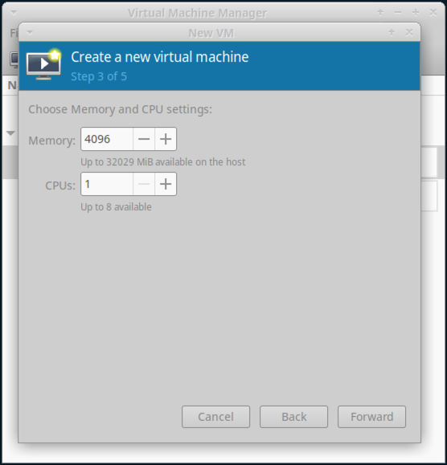

Ensure "Enable storage for this virtual machine" is selected and enter an image size:

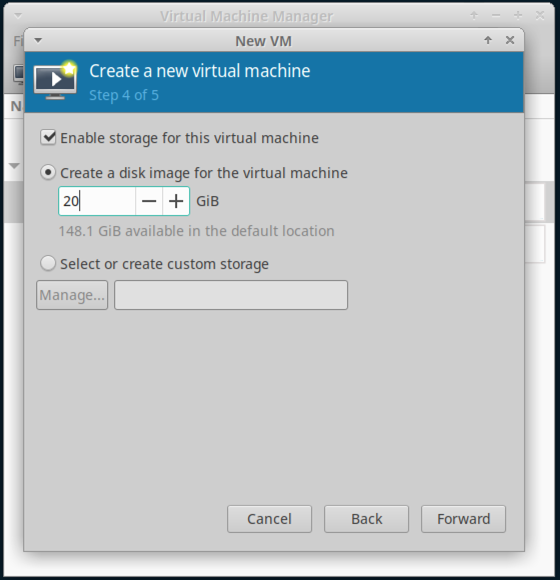

Name the VM and select Finish:

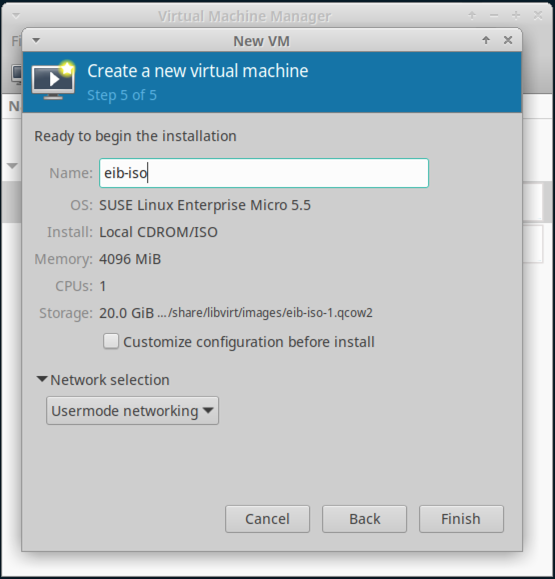

After pressing "Finish", the VM will boot. Depending on the version of the SLE Micro self install ISO, it may
prompt you to manually select the "Install SLE Micro" option before proceeding. In either case, stop the installation
by using the "Shutdown -> Force Off" option under the "Virtual Machine" menu. See the next step for more information
of what needs to happen before the installation can continue.

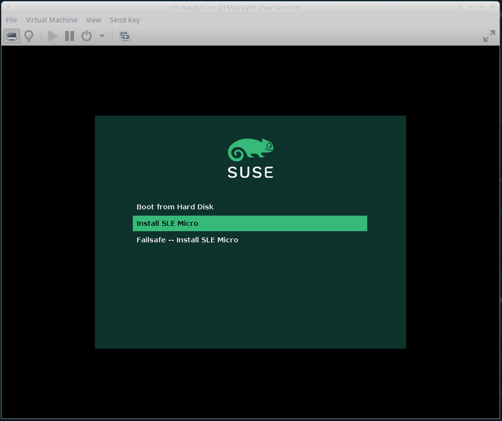

Under the "View" menu, select the "Details" item. Select the "CDROM" entry on the left. If the value of "Source path"
says "No media selected", use the "Browse" button to navigate to your ISO built by EIB. Once it is selected, press
"Apply".

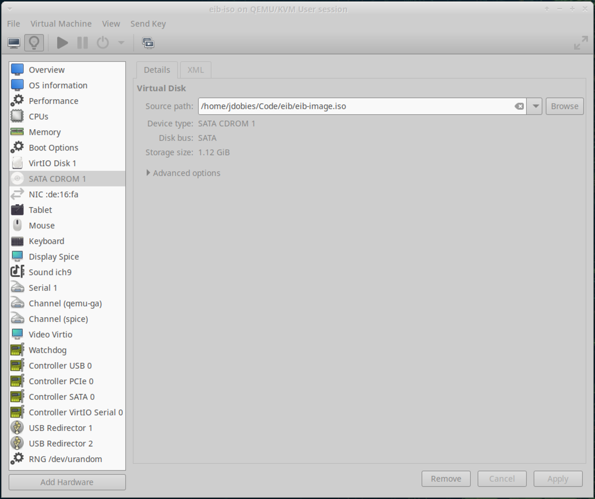

Select the "Boot Options" entry on the left. Ensure that the CDROM entry is checked.

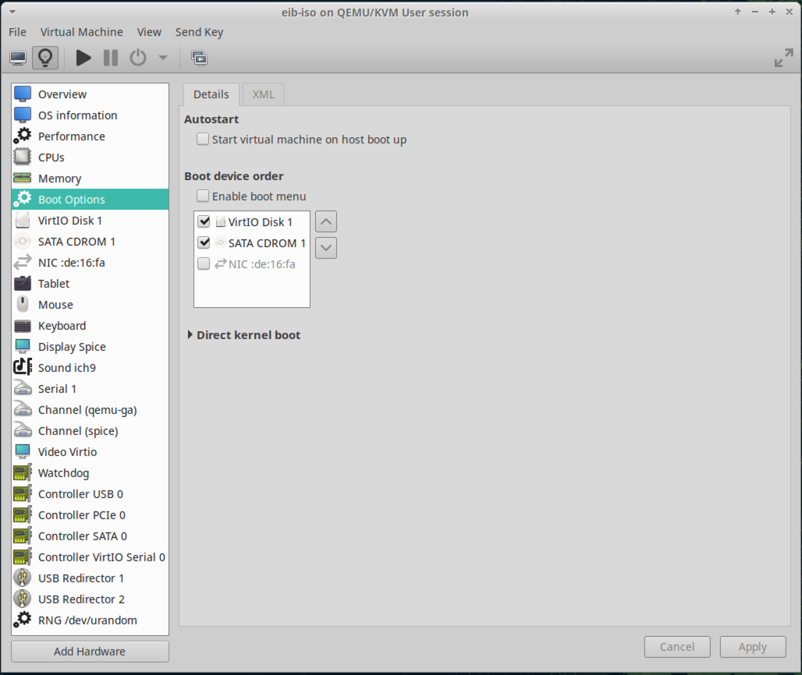

Once those two configuration value have been set, navigate back to the "Console" option under "View" and power on
the VM. If prompted, select the "Install SLE Micro" menu item and press "Yes" when prompted to delete all data on
`/dev/vda`. The installation will then copy the SLE Micro raw image to the VM disk and reboot. Upon reboot,
combustion should trigger and the JeOS installer should *not* appear.

Note that the following messages do not indicate an issue with the installation ISO. Combustion will still look inside
the ISO itself for the combustion configuration.

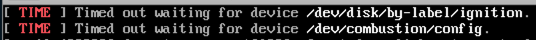

After combustion runs, the VM will display a message indicating it's been configured by the Edge Image Builder and
a login screen will be shown.

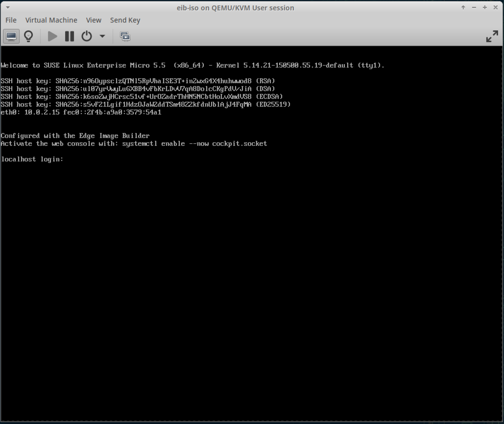

### Resetting the VM 

To save time, the process above does not need to be redone for each installation. Instead, the storage file for the
VM can be recreated, causing the installer ISO to act as if it is a fresh installation on a new disk. The path to
the disk image file can be found under the "Details" section of the VM.

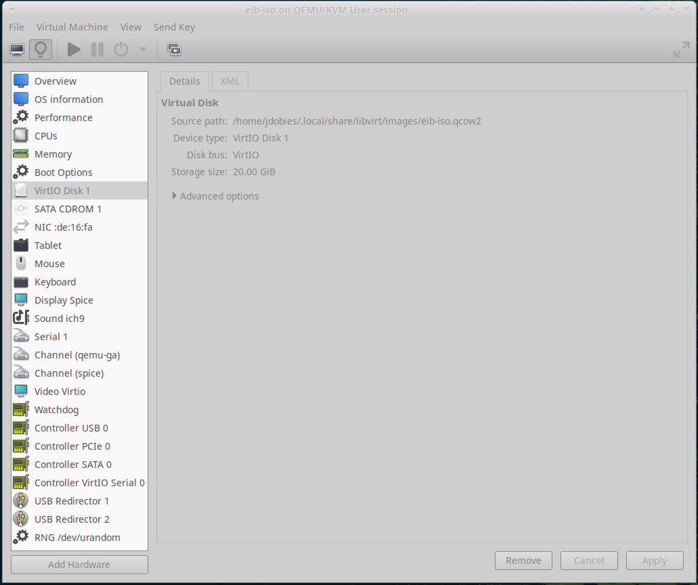

The image can be recreated between ISO installs using `qemu-img` (make sure the VM is powered off):

```bash
qemu-img create -f qcow2 ~/.local/share/libvirt/images/eib-iso.qcow2 20G
```

The next time the VM is powered on, it will trigger the ISO installer.
