# Testing Built Images

Images may be run on either bare metal or through virtualization. The following guide provides examples to speed
development and testing.

[libvirt](https://libvirt.org/) is a commonly available virtualization toolkit. Much of the development of EIB
has been tested against libvirt running on an [openSUSE Tumbleweed](https://get.opensuse.org/tumbleweed/)
installation. Other hypervisors may be used, but this guide will cover the specifics of libvirt in particular.

## Testing Self-installing ISOs

If you're already familiar with using libvirt to create images installed from ISOs, you can skip to the section
about [resetting the VM between tests](#Resetting-the-VM-for-Self-install-ISO-Testing ).

> :warning: libvirt may automatically remove the installation media after the first boot. Upon reboot, the installation
> ISO, and more importantly its embedded combustion configuration, will not be present and combustion won't run. If
> the JeOS installer begins, the first step in debugging should be to ensure the installation media is still present
> after the initial installation writes the SLE Micro raw image to disk.

Using Virtual Machine Manager, select the option to create a new VM. 

Select the "Local install media (ISO image or CDROM)" option:

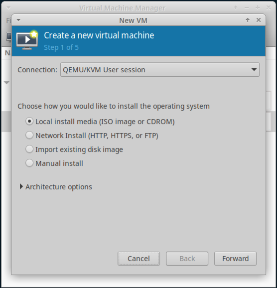

Browse to the ISO built by EIB. If Virtual Machine Manager is unable to detect the operating system, type `slem5.5`
to search for the "SUSE Linux Enterprise Micro 5.5" version:

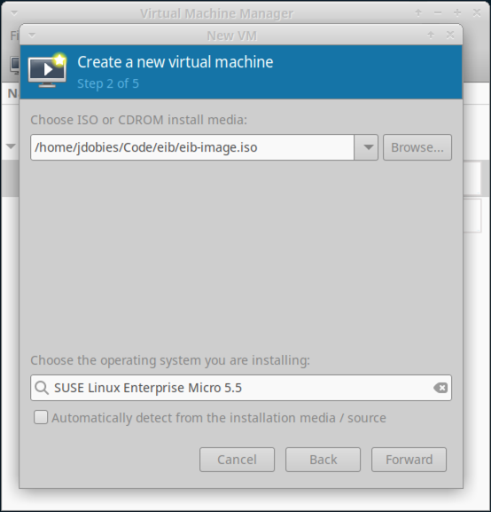

Enter the memory and CPU settings as appropriate for your host:

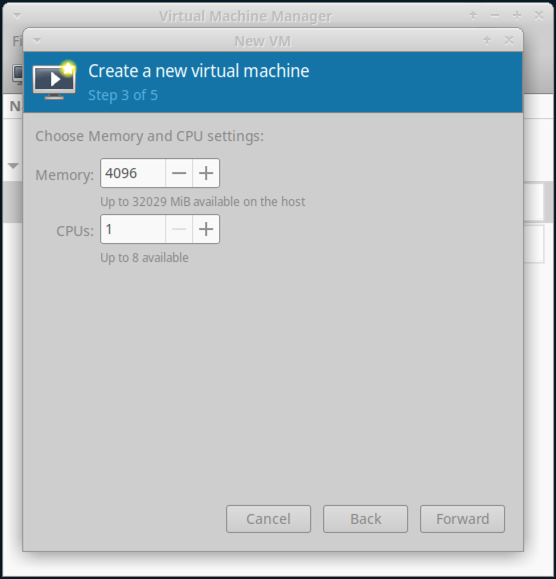

Ensure "Enable storage for this virtual machine" is selected and enter an image size:

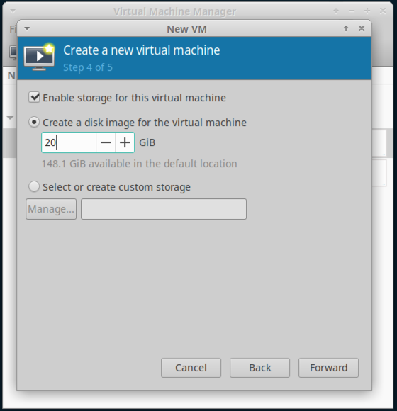

Name the VM and select Finish:

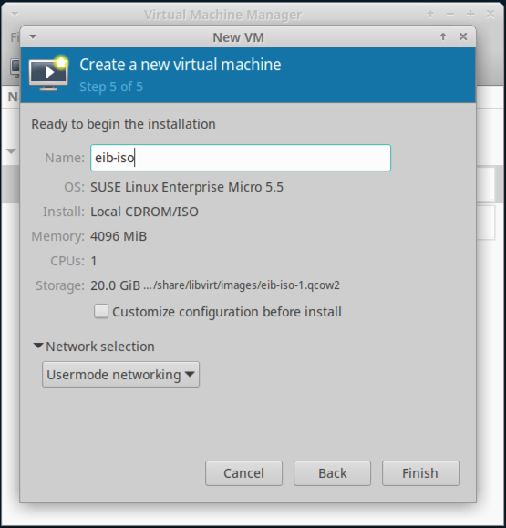

After pressing "Finish", the VM will boot. Depending on the version of the SLE Micro self-install ISO, it may
prompt you to manually select the "Install SLE Micro" option before proceeding. In either case, stop the installation
by using the "Shutdown -> Force Off" option under the "Virtual Machine" menu. See the next step for more information
on what needs to happen before the installation can continue.

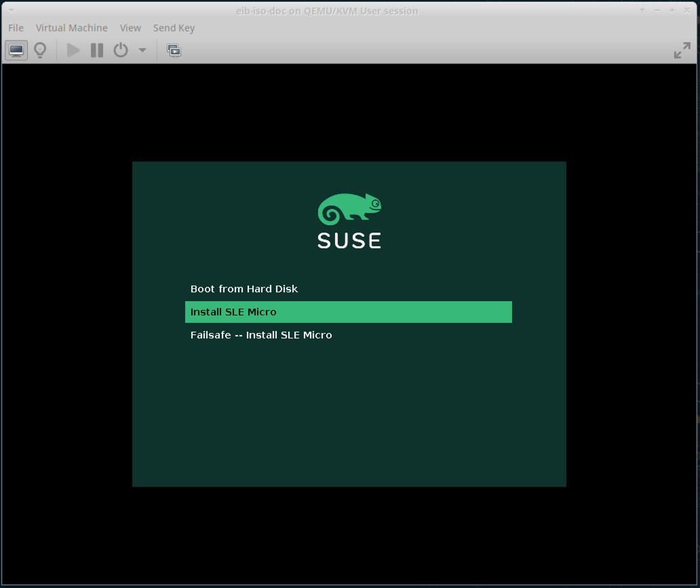

Under the "View" menu, select the "Details" item. Select the "CDROM" entry on the left. If the value of "Source path"
says "No media selected", use the "Browse" button to navigate to your ISO built by EIB. Once it is selected, press
"Apply".

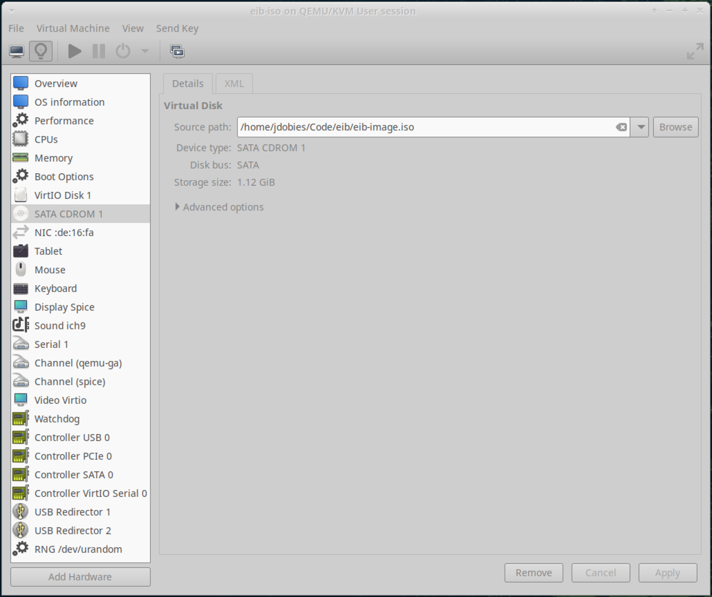

Select the "Boot Options" entry on the left. Ensure that the "CDROM" entry is checked and press "Apply".

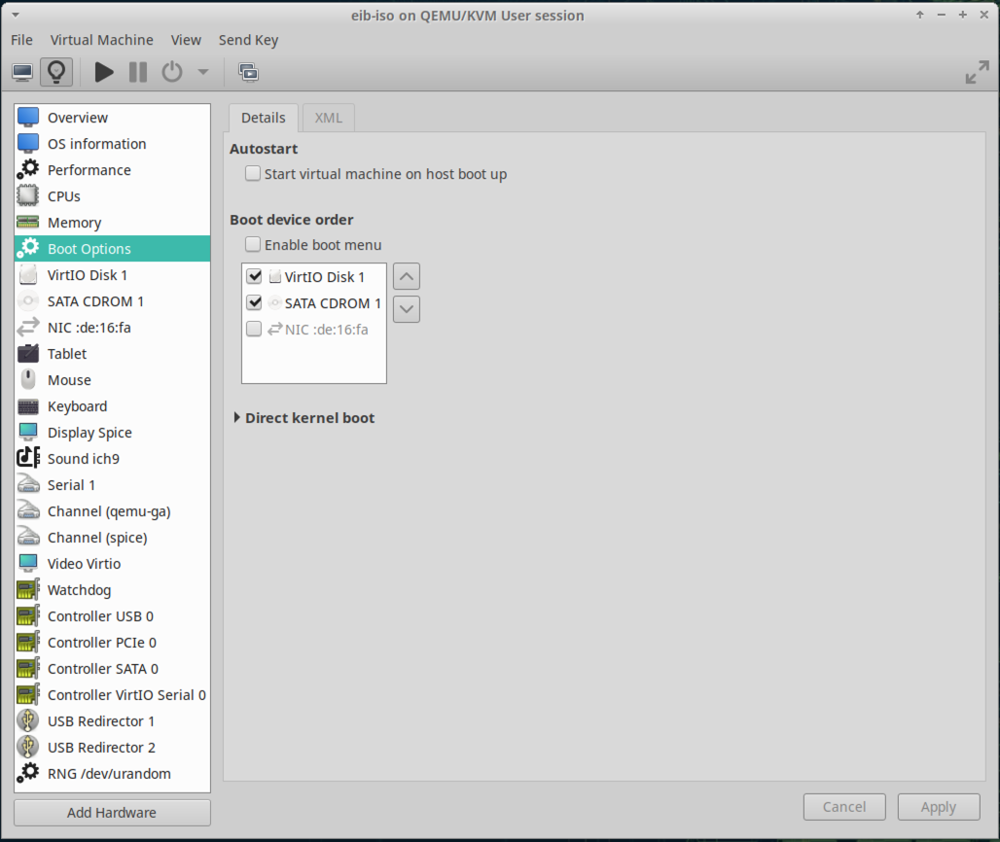

Once those two configuration values have been set, navigate back to the "Console" option under "View" and power on
the VM. If prompted, select the "Install SLE Micro" menu item and press "Yes" when prompted to delete all data on
`/dev/vda`. The installation will then copy the SLE Micro raw image to the VM disk and reboot. Upon reboot,
combustion should trigger and the JeOS installer should *not* appear.

After combustion runs, the VM will display a message indicating it's been configured by the Edge Image Builder and
a login screen will be shown.

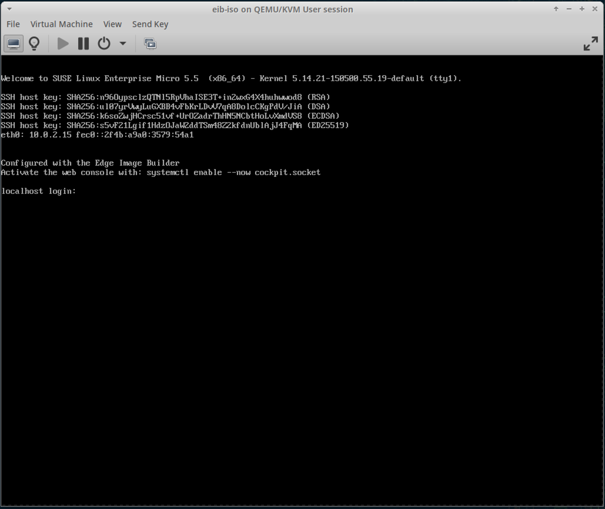

### Resetting the VM for Self-install ISO Testing 

To save time, the process above does not need to be repeated for each installation. Instead, the storage file for the
VM can be recreated, causing the installer ISO to act as if it is a fresh installation on a new disk. The path to
the disk image file can be found under the "Details" section of the VM.

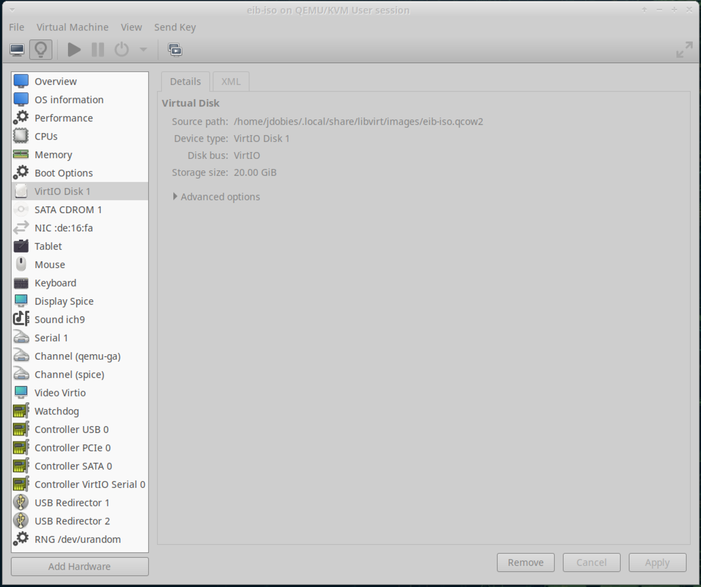

The image can be recreated between ISO installs using `qemu-img` (make sure the VM is powered off):

```bash
qemu-img create -f qcow2 ~/.local/share/libvirt/images/eib-iso.qcow2 20G
```

The next time the VM is powered on, it will trigger the ISO installer.

### Testing using virt-install (CLI)

If you want to use the command line to deploy the VM and test it with your EIB generated image, you could use the following process:

- The first step is to create an empty disk for the VM:

`qemu-img create -f qcow2 example.img 6G`

- Next, use virt-install to define and run a VM using the EIB generated image:

```
virt-install --name testVM \ 
             --memory 4096 \
             --vcpus 4 \
             --disk ./example.img \
             --install no_install=yes \
             --cdrom ./eib-image-generated.iso \
             --network default \
             --osinfo detect=on,name=sle-unknown
```

During the first boot, you'll need to install the OS following the instructions. After installation, a reboot will happen. Subsequent boots will use the "Boot From Disk" option to boot from the installed OS.

## Testing RAW Images

Using Virtual Machine Manager, select the option to create a new VM.

Select the "Import existing disk image" option:

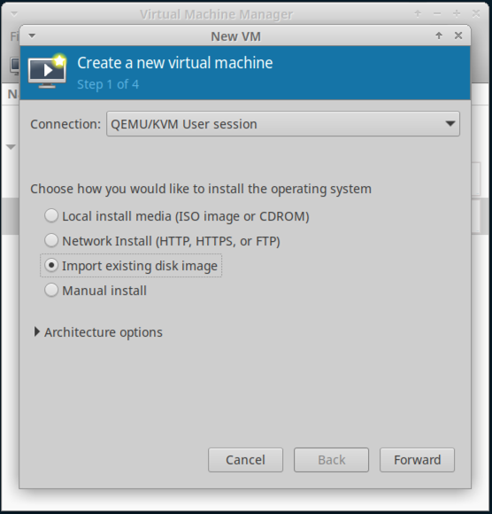

Navigate to the raw image built by EIB and set the OS to "SUSE Linux Enterprise Micro 5.5"
(or type `slem5.5`):

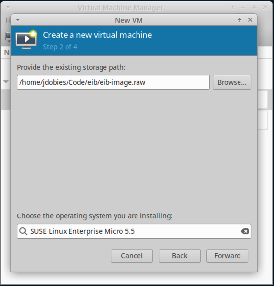

Continue through the creation wizard, adjusting the defaults as necessary.

Once the VM is configured, simply power it on to boot into the raw image. Similar to the self-install ISO instructions,
the JeOS installer should not appear. Instead, combustion should take over the installation and the VM will boot
into a login screen. A message will display indicating it's been configured by the Edge Image Builder.


### Resetting the VM for RAW Image Testing

Unlike the installer ISO, there isn't anything specific that needs to be done when testing multiple iterations of
a raw image. EIB can be used to overwrite the raw image attached to a VM and, when the VM is booted, it will use
the newly built image.

## General Notes

The following messages do not indicate an issue with the installation ISO. Combustion will still look inside
the ISO itself for the combustion configuration.

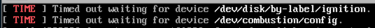

